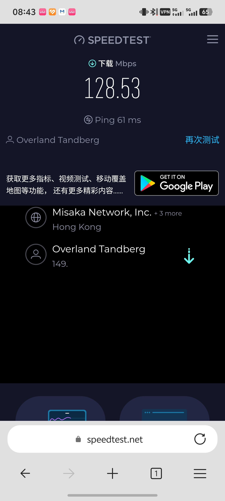
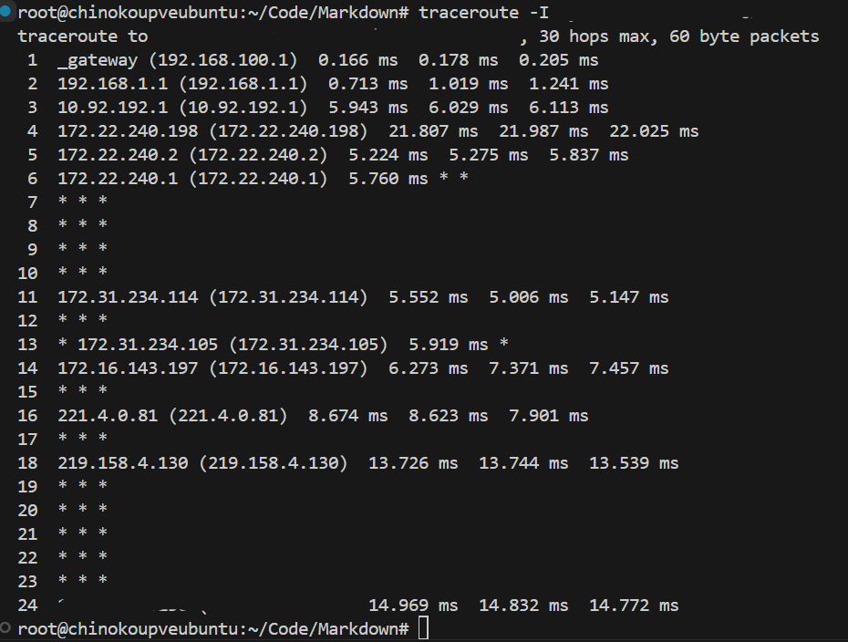
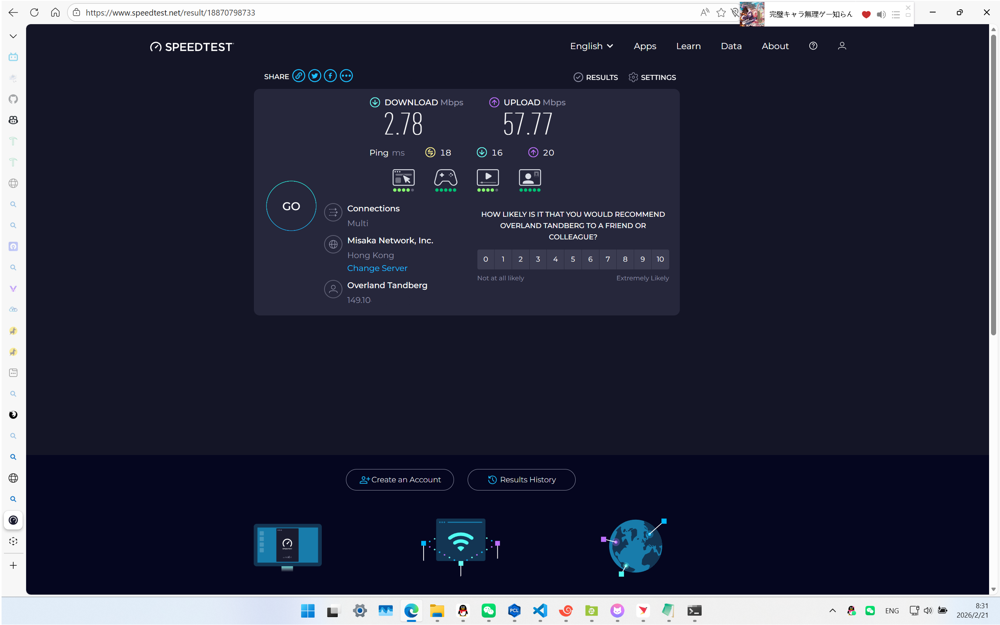
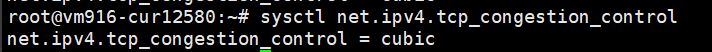
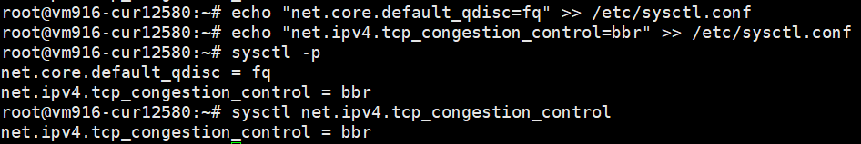
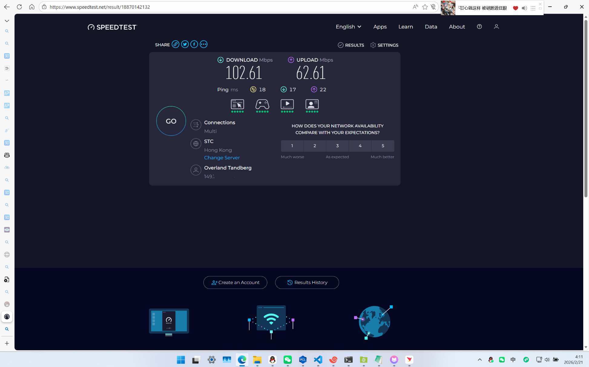
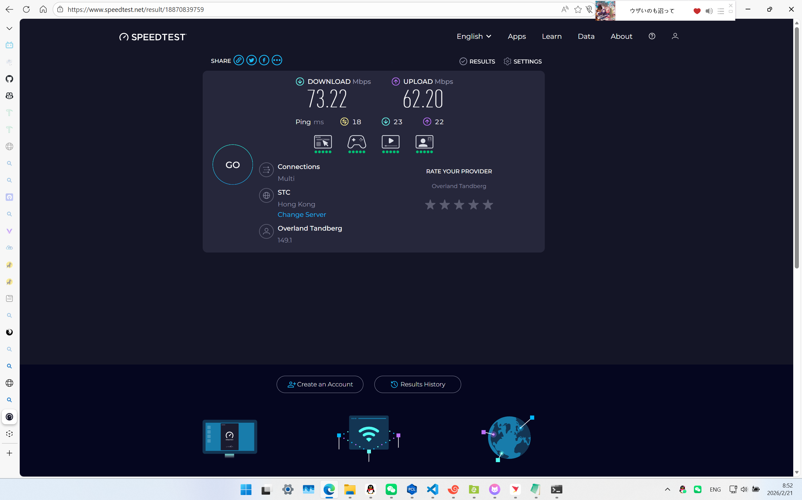

## 背景

- 一台三网优化的香港 VPS，宽带 200Mbps，并且部署了 Xray 和 Hysteria2-Server 服务
- OpenWrt 部署 Mihomo(Meta) 代理核心与 Nikki 服务
- 放假回家没办法只能使用广东广电网络宽带，PVE 上的 OpenWrt 上游 (WAN) 接入广电网络，并提供全部设备与虚拟机和宿主机 (PVE) 的网络，并且全部导流进入 Mihomo 核心

> 也就是说，本文所有与网络有关操作未特别提及的，都是自动进入代理核心导流，配置文件规则都是正常的，并且只有一条 VLESS 链路可用

## 起因

Mihomo 代理核心显示只有 VLESS 服务能连接，Hysteria2 则被完全阻断，并且唯一活着的 VLESS 链路特别卡，直接无法加载，包括但不限于以下场景：

- `git` `clone` / `push` / `fetch` / `pull`
- `docker pull`
- `pip install`
- `npm` / `pnpm` `install`
- GitHub Web / Copilot
- VS Code 插件安装 / 核心更新
- 各种基于 `github.io` 的文档
- 咕噜咕噜搜索还有各种服务 (yt 等)

> 插件装半小时装不上，文档转半天打不开，依托石。

## 排查本地网络和位于香港服务器之间的连接

### Speedtest.net 测速

- 页面加载半天，加载出来测速只有**几十 Bytes/s**
- 手机流量接入代理（一样的配置文件）测速，VLESS 和 Hysteria2 两个协议都可以跑满带宽，即 200Mbps（服务器宽带）/ 2 ≈ 100Mbps 下行，测试结果如下图：

<div align="center">
  
</div>

> 测速结果甚至超了

### PING 和 TCPING 测试

- 0 丢包，而且延迟极低（10\~20ms，毕竟三网优化...）
- 在线工具 [ITDOG-ping](https://www.itdog.cn/ping/) 和 [ITDOG-tcping](https://www.itdog.cn/tcping/) 均 0 丢包，延迟也很低

### 路由追踪去程测试

- Windows 上直接 `tracert <ip>`，结果无参考价值
- Linux 上直接 `traceroute <ip>`，结果无参考价值
- 再次 traceroute，更换 ICMP 协议，使用 `traceroute -I <ip>`，测试结果如下图：

<div align="center">
  
</div>

- Linux 上直接 mtr 也可以：`mtr -rw <ip>`

> 值得一提的是，gcable(广东广电网络) 的国际出口走的是中国联通的线路，`219.158.x.x` 是 `AS4837 [CU169-BACKBONE]`

## 猜测

- 域名未被墙，向 IP 发送 TCP 包未被 TCP RST，并且限速非 GFW 原因
- 非服务器 / 服务商网络原因
- 确定为运营商原因，中国移动正常，家里广电宽带才会出现这种情况
- UDP 包（QUIC 协议）发向未备案的域名被运营商丢弃
- 疑似被运营商网关设备 DPI 检测然后 QoS 限速

## 尝试解决

### UDP 封锁

没招，`QUIC` / `Hy2` 随缘了，不打算折腾

### QoS 限速

猜测是因为配置文件写的不好，伪装性不够强，被识别然后 QoS。

因为这个协议的抗审查和伪装性体现在伪装一个 HTTPS 的 Web 服务器，意味着 TCP port 应为 `443`，并且 SNI 正常。
因为服务器上部署了 Web 服务，并且 Nginx 监听 `443`，导致我最开始没让 Xray 服务监听 `443`，而是监听 `49999`，并且 SNI 为 `www.polyu.edu.hk`，导致看起来不像是个正常的 HTTPS 服务器，故被限速。

**解决方案：SNI 更换为苹果系统的更新服务器，尝试走 443**

#### 第一步：修改 Nginx 配置

修改 `nginx.conf`，为 Nginx 配置一层 stream，让 Nginx 识别 SNI 然后分流：

```nginx
# stream 块与 http 块同级
stream {
    map $ssl_preread_server_name $backend_name {
        swdist.apple.com xray_backend;
        default nginx_web;
    }

    upstream xray_backend {
        server 127.0.0.1:49999;
    }

    upstream nginx_web {
        server 127.0.0.1:8443;
    }

    server {
        listen 443;
        listen [::]:443;
        proxy_pass $backend_name;
        ssl_preread on;
    }
}
```

然后再修改 `http` 块里各 `server` 的监听端口，改为 `8443`，即刚刚 stream 导流的后端。

```bash
nginx -t                    # 检查配置文件
systemctl restart nginx     # 重启 Nginx 服务
```

这样就可以让 Nginx 识别到苹果的 SNI，导流入本地 `49999`，即 Xray 服务。

修改防火墙，关闭 `49999` 公网访问：

```bash
ufw status verbose          # 查看目前规则
ufw delete allow 49999      # 删除规则
```

这样对外暴露的代理链路看起来就是个正常的 HTTPS 服务。

#### 第二步：修改 Xray 配置

修改 Xray 的配置文件 `/usr/local/etc/xray/config.json`：

- 修改 `inbounds`->`streamSettings`->`realitySettings` 下的 `dest` 和 `serverNames`
- 分别修改为 `swdist.apple.com:443` 和 `["swdist.apple.com"]`

```bash
systemctl restart xray      # 重启 Xray 服务
```

#### 第三步：修改代理配置文件

修改客户端代理配置文件 `xxx.yaml`：

- 将 `port` 从 `49999` 改为 `443`
- 将 `servername` 改为 `swdist.apple.com`
- 将 `client-fingerprint` 从 `chrome` 改为 `safari`

#### 测试结果

重启 Mihomo 应用新配置文件，Speedtest.net 测速，下行飙升至 **2Mbps\~10Mbps**：

<div align="center">
  
</div>

仍被限速，查询后得知为运营商限制访问海外**单条 TCP 连接**速度，方式为随机丢包，可通过开启 VPS 的 BBR 算法缓解。

### 开启 BBR 拥塞控制

优先检查是否开启了 BBR：

```bash
sysctl net.ipv4.tcp_congestion_control
# 输出：net.ipv4.tcp_congestion_control = cubic
# 为传统的 TCP 拥塞控制，默认算法
```

<div align="center">
  
</div>

未开启 BBR，通过以下命令开启：

```bash
echo "net.core.default_qdisc=fq" >> /etc/sysctl.conf
echo "net.ipv4.tcp_congestion_control=bbr" >> /etc/sysctl.conf
sysctl -p
```

再次检查：

```bash
sysctl net.ipv4.tcp_congestion_control
# 输出：
# net.core.default_qdisc = fq
# net.ipv4.tcp_congestion_control = bbr
```

<div align="center">
  
</div>

再次 Speedtest.net 测速，下行跑到了 **102Mbps**！

<div align="center">
  
</div>

我想，不应该会这么顺利啊，再次测速，下行掉到了大约 **70Mbps**，果然，我就知道。
其实是反应过来了，然后继续限速，不过有一说一，这个其实已经够用了。

<div align="center">
  
</div>


> 如果还要折腾，可以尝试使用多路复用技术，但是那样会失去 Vision 流控的 Reality，伪装性会下降一个大档次，然后又被QoS，甚至有可能连带IP和端口一起封死。
